# Encriptador de Textos

Este es un proyecto que realice en mi paso por el programa "Oracle Next Education" de Alura. 

Se trata de un Encriptador/Desencriptador de Textos. 

# Usabilidad

Usted puede ingresar un texto y elegir Encriptarlo, luego compartir ese texto Encriptado con un tercero y esa persona podrá ingresar el texto Encriptado en la aplicación para poder Desencriptarlo y así descubrir el mensaje que estaba detras de esa encriptación.

# Funcionalidades

<h3>Creé 5 Variantes de colores para que el usuario pueda elegir cuál le agrada más.</h3>

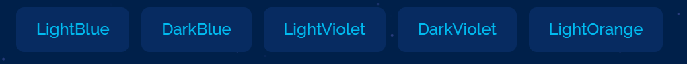 
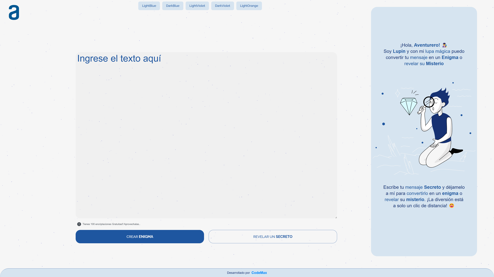
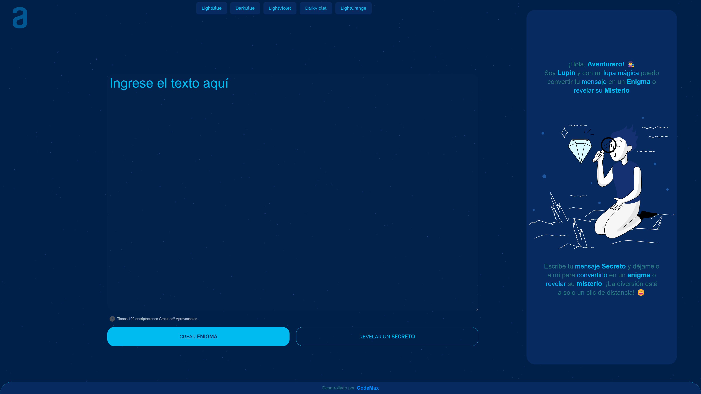
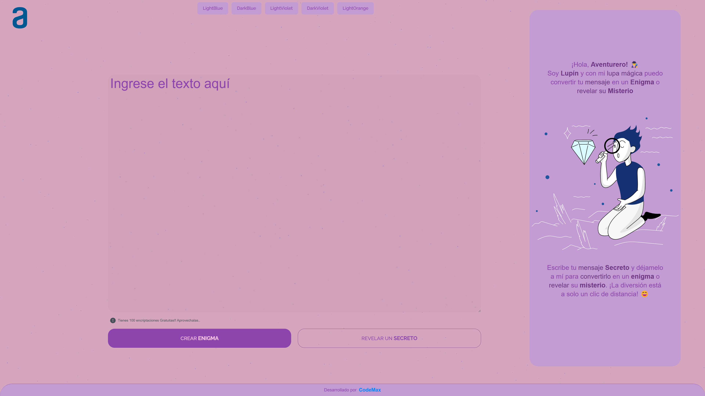
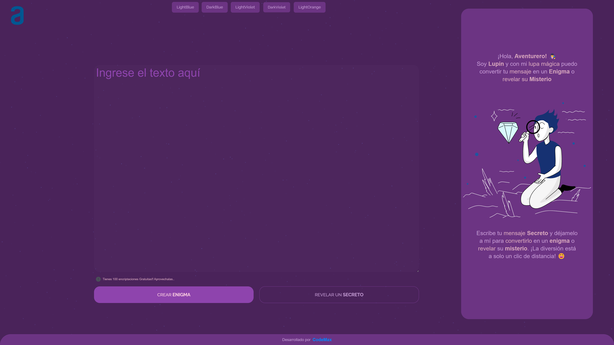
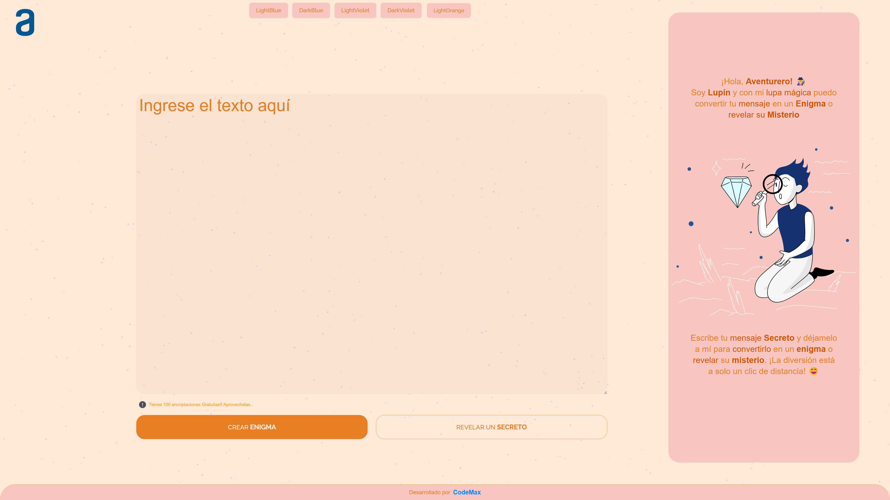

Esta elección se guarda en un LocalStorage así cuando el usuario vuelve a entrar a la aplicación se inicializa con los colores Elegidos en la sesión anterior.

<h3>Encriptación</h3>

Esta es la pantalla inicial de la aplicación, en la cuál al lado Derecho se mustra un texto con instrucciones.

 

El usuario Ingresa un Texto para ser Encriptado, y el texto e instrucciones del lado derecho Cambian.

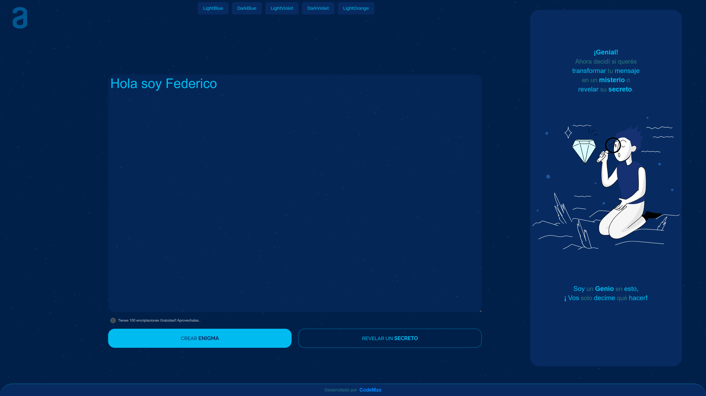 

Al presionar el Botón "CREAR ENIGMA" cambia nuevamente el texto del lado derecho, y proporciona el texto Encriptado.

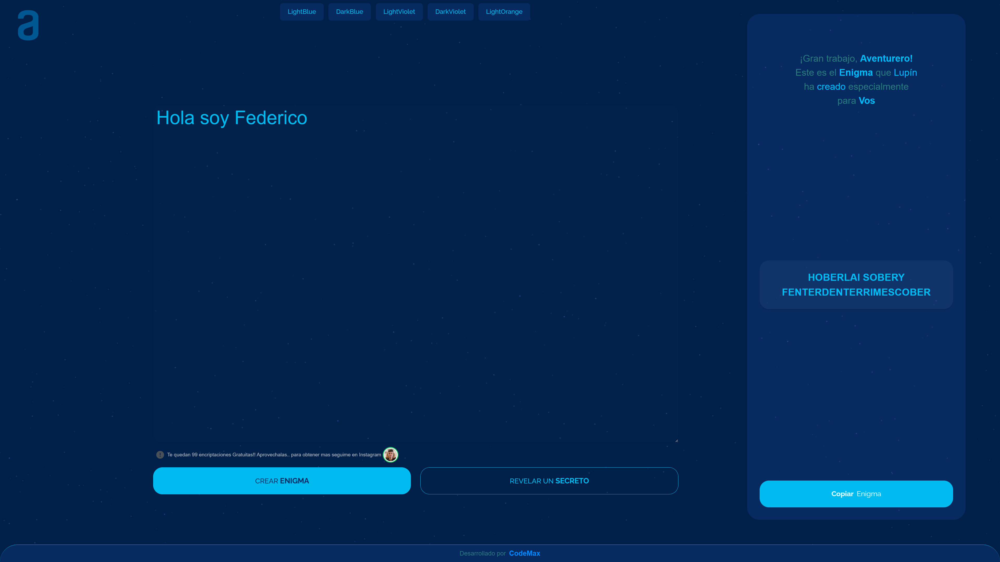 

El usuario puede copiar el mensaje encriptado presionando el Botón "Copiar Enigma".

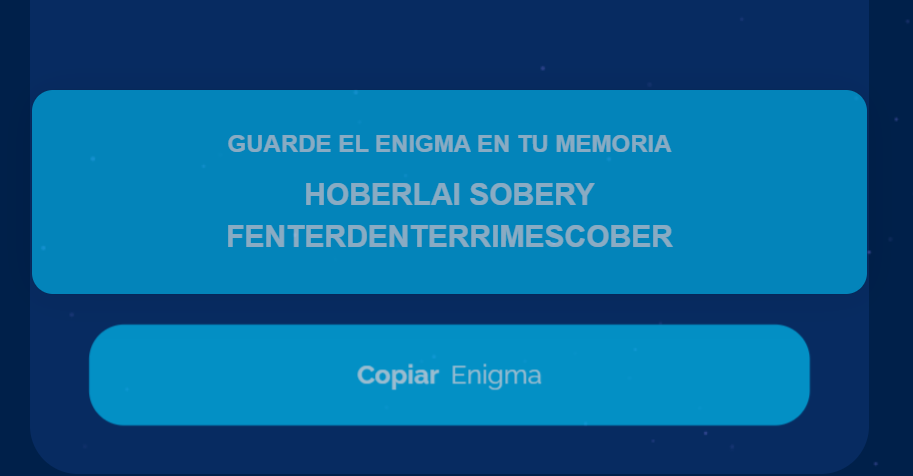 

<h3>Desencriptación</h3>

De la misma manera el usuario puede ingresar un Texto Encriptado para descubrir el mensaje que cubre.

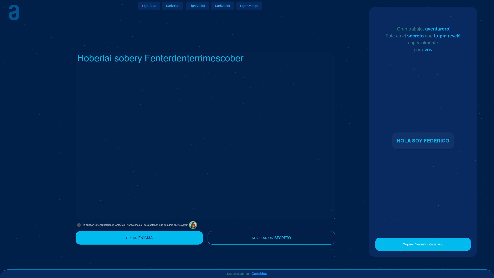 

<h3>Tambien hice un Contador que funciona con LocalStorage y va decrementando a medida que el usuario realiza Encriptaciones o Desencriptaciones</h3>

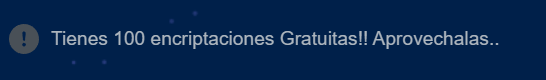

# Puede utilizar la Aplicación en el siguiente enlace:
https://text-encryptor-fedeestrubia.netlify.app/

# Tecnologías Utilizadas

- Vite (Empaquetador de Archivos y Servidor de Desarrollo)
- React (Biblioteca Javascript)
- TailwindCSS (Framework CSS)
- Netlify (Alojamiento del Proyecto)
- GitHub (Repositorio del Proyecto)
- VSCode (Editor de Codigo)

- [@vitejs/plugin-react](https://github.com/vitejs/vite-plugin-react/blob/main/packages/plugin-react/README.md) uses [Babel](https://babeljs.io/) for Fast Refresh
- [@vitejs/plugin-react-swc](https://github.com/vitejs/vite-plugin-react-swc) uses [SWC](https://swc.rs/) for Fast Refresh
